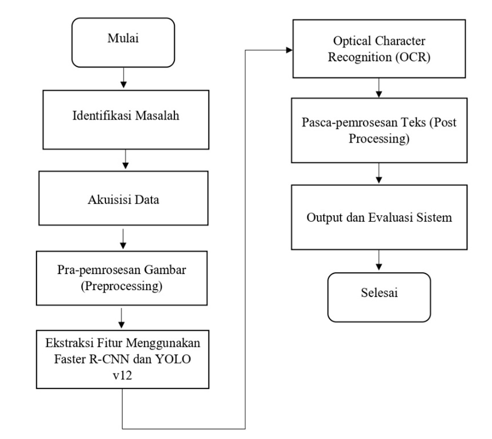
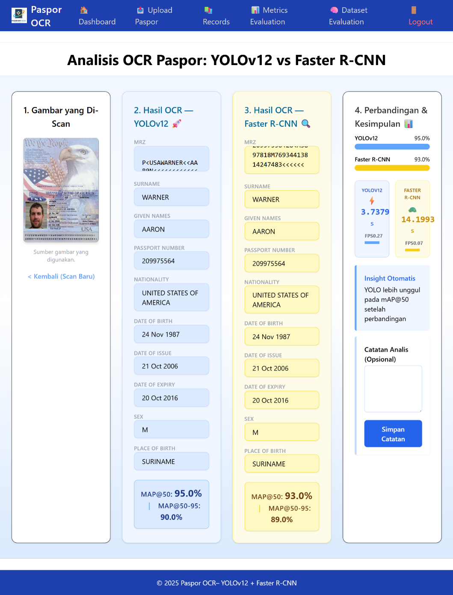
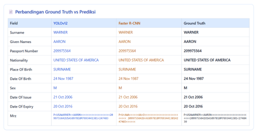
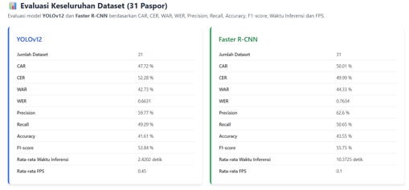

# 🛂 PAS-OCR DL

## Passport Optical Character Recognition Based on Deep Learning

PAS-OCR DL is a web-based Optical Character Recognition (OCR) system developed for automatic passport information extraction using Deep Learning and Computer Vision technologies.

The system implements and compares two state-of-the-art object detection models, **YOLOv12** and **Faster R-CNN**, integrated with OCR techniques to extract textual information from passport documents automatically.

---

### 🔬 Research Publication

**Comparison of Faster R-CNN and YOLO v12 on Passport Text Extraction Based on Optical Character Recognition**
Published in a **SINTA 4 Accredited Journal**.

### Publication Resources

📄 Full Paper (PDF)
https://journal.thamrin.ac.id/index.php/jtik/article/view/3307/2766

📚 Journal Issue
https://journal.thamrin.ac.id/index.php/jtik/issue/view/161

📁 Repository Copy
The publication is also available in the `publication/` folder of this repository.

---

### Citation
Masniari Samosir, et al. (2026).
*Comparison of Faster R-CNN and YOLO v12 on Passport Text Extraction Based on Optical Character Recognition.*
Jurnal Teknologi Informatika dan Komputer MH. Thamrin.

---

## 📂 Repository Contents

* Research Publication (SINTA 4)
* PAS-OCR DL User Guide
* Research Workflow and Architecture
* Dataset Information
* OCR Evaluation Results
* Ground Truth vs Prediction Analysis
* System Implementation Screenshots

---

## 🚀 Key Features

* Passport Information Extraction
* YOLOv12-based Object Detection
* Faster R-CNN-based Object Detection
* OCR-based Text Recognition
* Comparative Performance Analysis
* Dashboard Analytics
* Database Storage and Management
* Evaluation Metrics Visualization

---
## 📂 Repository Structure

The repository is systematically organized to support the entire research workflow, from dataset preparation and image preprocessing to object detection, OCR processing, web application development, performance evaluation, and research dissemination. Each module is designed to improve maintainability, reproducibility, and ease of understanding for researchers, developers, and practitioners.

passport-ocr-yolov12-frcnn/
│
├── app.py                  # Main Flask application
├── requirements.txt        # Python project dependencies
│
├── architecture/           # Research workflow and system architecture
├── dataset/                # Sample dataset and configuration files
├── detection/              # YOLOv12 and Faster R-CNN implementation
├── docs/                   # User guide and project documentation
├── ground_truth/           # Ground truth annotations for evaluation
├── preprocessing/          # Image preprocessing modules
├── publication/            # Published research paper (SINTA 4)
├── screenshots/            # Application and evaluation screenshots
├── static/                 # Static assets (CSS, JavaScript, and images)
├── templates/              # HTML templates for the Flask web application
└── test/                   # Testing and utility scripts

```
## 🔄 Research Workflow

The following workflow illustrates the research methodology used in developing the PAS-OCR DL system.



---

## 📊 Research Results

### OCR Comparison Result

Comparison of information extraction results generated by YOLOv12 and Faster R-CNN.



### Ground Truth vs Prediction

Comparison between model predictions and the ground truth values.



### Overall Evaluation

Performance evaluation results of the proposed system.



---

## 🤖 Technologies Used

* Python
* Flask
* YOLOv12
* Faster R-CNN
* EasyOCR
* OpenCV
* MySQL

---

## 📈 Research Areas

* Artificial Intelligence
* Deep Learning
* Computer Vision
* Optical Character Recognition (OCR)
* Document Intelligence
* Information Extraction

---

## 👩‍🎓 Author

**Masniari Samosir**

Master of Informatics Engineering

Research Interests:

* Artificial Intelligence
* Deep Learning
* Computer Vision
* OCR
* Intelligent Document Processing

---

## 📜 License

This repository is intended for academic research, educational purposes, and portfolio demonstration.
